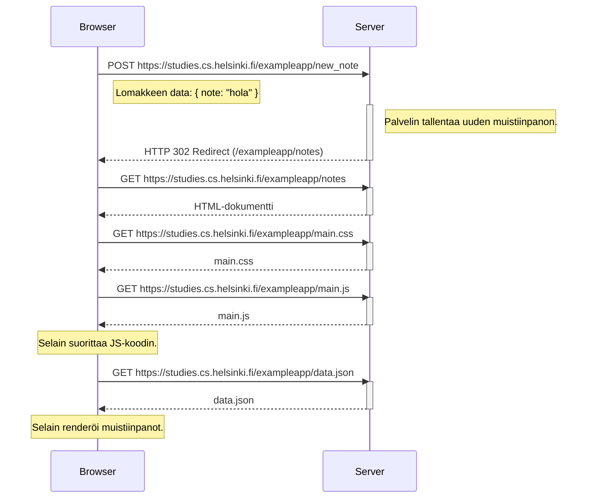

```mermaid 
sequenceDiagram
    participant Browser
    participant Server

    Browser->>Server: POST https://studies.cs.helsinki.fi/exampleapp/new_note
    Note right of Browser: Lomakkeen data: { note: "hola" }

    activate Server
    Note right of Server: Palvelin tallentaa uuden muistiinpanon.
    Server-->>Browser: HTTP 302 Redirect (/exampleapp/notes)
    deactivate Server

    Browser->>Server: GET https://studies.cs.helsinki.fi/exampleapp/notes
    activate Server
    Server-->>Browser: HTML-dokumentti
    deactivate Server

    Browser->>Server: GET https://studies.cs.helsinki.fi/exampleapp/main.css
    activate Server
    Server-->>Browser: main.css
    deactivate Server

    Browser->>Server: GET https://studies.cs.helsinki.fi/exampleapp/main.js
    activate Server
    Server-->>Browser: main.js
    deactivate Server

    Note over Browser: Selain suorittaa JS-koodin.

    Browser->>Server: GET https://studies.cs.helsinki.fi/exampleapp/data.json
    activate Server
    Server-->>Browser: data.json
    deactivate Server

    Note over Browser: Selain renderöi muistiinpanot.
```