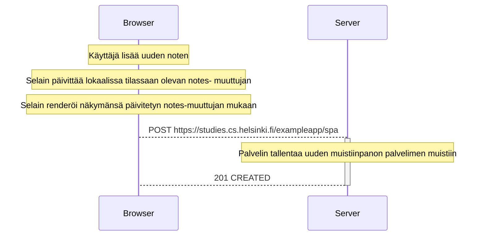

# SPA POST -request

```mermaid
sequenceDiagram
    participant Browser
    participant Server

        Note over Browser: Käyttäjä lisää uuden noten 
        Note over Browser: Selain päivittää lokaalissa tilassaan olevan notes- muuttujan
        Note over Browser: Selain renderöi näkymänsä päivitetyn notes-muuttujan mukaan
        Browser-->Server: POST https://studies.cs.helsinki.fi/exampleapp/spa
        activate Server
        Note over Server: Palvelin tallentaa uuden muistiinpanon palvelimen muistiin
        Server-->Browser: 201 CREATED
        deactivate Server

```